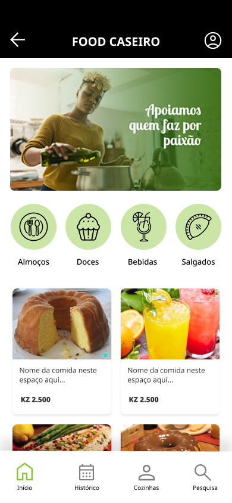

<h1 align="center">
     Food Caseiro
</h1>

 Is a food delivery Mobile app. 🚚

<h1 align="center">
    🔗 technologies used

</h1>

<h2 >
    <a href="https://reactnative.dev/"> React Native</a>
</h2>

<h2 >
    <a href="https://expo.dev/client"> Expo Go</a>
</h2>
<h2 >
    <a href="https://spring.io/"> Spring Boot</a>
</h2>

<h2>
    <a href="https://www.mysql.com/"> Mysql</a>
</h2>

### To run the project, run the following commands:

1. ``yarn install.`` => to install all dependencies
1. ``expo start dev.`` =>   to start the app

## By : Estevao Mbala 🚀 

 
